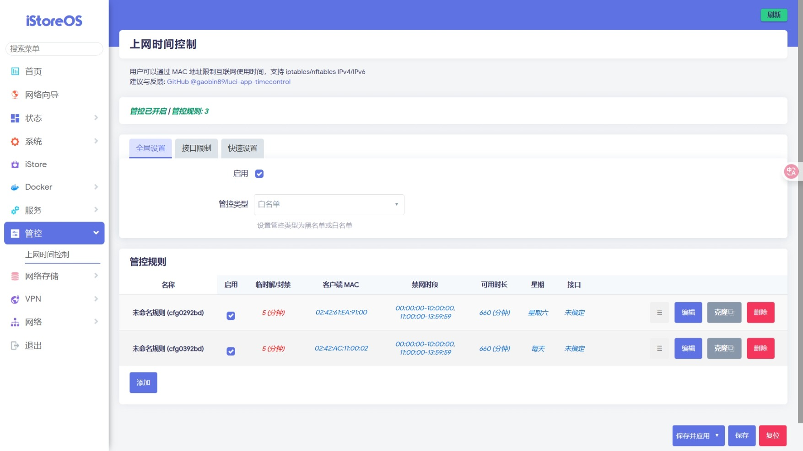

# luci-app-timecontrol

- lua版：在[Lienol luci-app-timecontrol](https://github.com/Lienol/openwrt-package/tree/main/luci-app-timecontrol)基础上修改而来，目前已弃用。
- Javascrip版：全新UI界面、自主开发

这个版本主要是为了家里两只“神兽”定制开发，方便限制“神兽”使用各种电子设备（手机、平板、TV）；当“神兽”完成特定任务后，方便给予临时时长奖励或惩罚，且不会忘记重新开启限制。

## 功能特性

### 1. 支持单一规则多MAC地址、多时段
- 单条规则可配置多个MAC地址和多个时间段
- 简化配置管理，提高规则复用性

### 2. 自适应FW3/FW4防火墙
- 自动检测系统使用的防火墙类型
- 兼容OpenWrt不同版本的防火墙系统（仅在[iStoreOS](https://github.com/istoreos/istoreos)、[LEDE](https://github.com/coolsnowwolf/lede)、[OpenWrt](https://github.com/openwrt/openwrt)上测试，理论上所有OpenWRT版本通用，请自行测试）

### 3. 支持IPv4/IPv6双协议栈
- 同时支持IPv4和IPv6地址过滤
- 自动清理IPv4/IPv6链接（需要单独安装conntrack命令）

### 4. 星期设置
- 星期全选或全未选择均视为"每天"生效

### 5. 规则守护功能
- 防止开启OpenClash等工具后禁网规则不在链首位置
- 自动监测规则链顺序，确保禁网规则优先级
- 规则位置异常时自动修复

#### 注：
- 为节省资源和兼顾“临时解禁/封禁”功能，监测频率为：1次/60s

### 6. 临时解禁/封禁功能
- 支持临时解除网络限制和封禁网络
- 时长范围：1~720分钟
- 提供便捷的一键解禁/封禁操作
- 方便给予“神兽”临时性奖励或惩罚
- 临时性奖励或惩罚计时结束后，自动按原规则生效

### 7. 防火墙规则写入优化

#### FW3 iptables：
- 单一规则多MAC地址采用ipset hash:mac集合方式写入规则链

#### FW4 nft：
- 单一规则多时段、多MAC地址均采用集合方式写入规则链
- 如时段转换成UTC时段后存在跨天，则自动拆分时段

#### 注：
#### 1. nft meta hour {"xx:xx:xx"-"xx:xx:xx"} 集合用法需要将时段转成UTC时段且不支持跨天时段
#### 例如：北京时间"06:00:00-13:00:00"转换为UTC时间后是"22:00:00-05:00:00"，这将导致nft报错"Error: Range negative size"

#### 2. 将北京时间"06:00:00-13:00:00"拆分成"06:00:00-07:59:59","08:00:00-13:00:00"后，则可正常写入

### 8. 管控类型
- 支持黑/白名单切换
- 默认为：黑名单
- 白名单支持指定拒绝接口，默认为空（即：拒绝所有接口）

#### 注：白名单模式规则处理逻辑
#### 1. ‘禁网时段’为空和‘星期’为每天（星期1~7）时，则表示全开放
#### 2. Docker等使用NAT转发的，请在‘拒绝接口’中排除相应接口或添加MAC地址到规则
#### 3. ‘禁网时段’不为空时，则按设定的‘禁网时段’和选中的‘星期’禁网（即：按‘黑名单’规则逻辑处理）
#### 4. ‘禁网时段’为空和‘星期’不为每天（星期1~7）时，则选中‘星期’的所有时段禁网（即：按‘黑名单’规则逻辑处理）

## 界面

