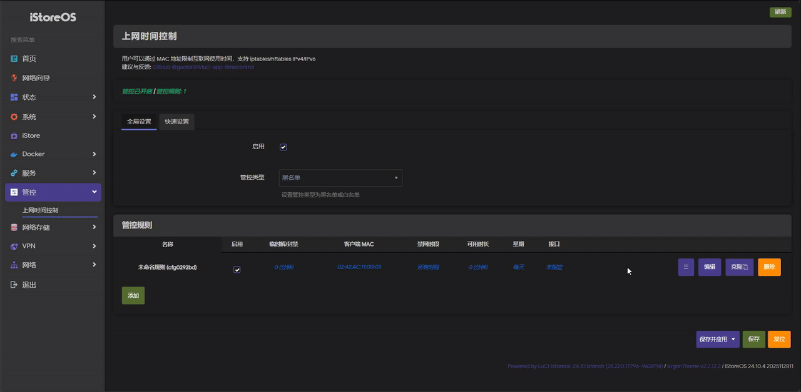
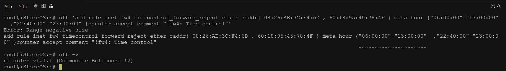
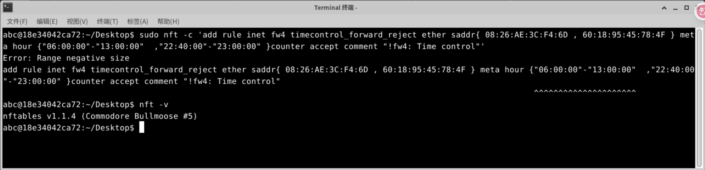
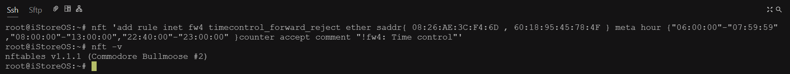
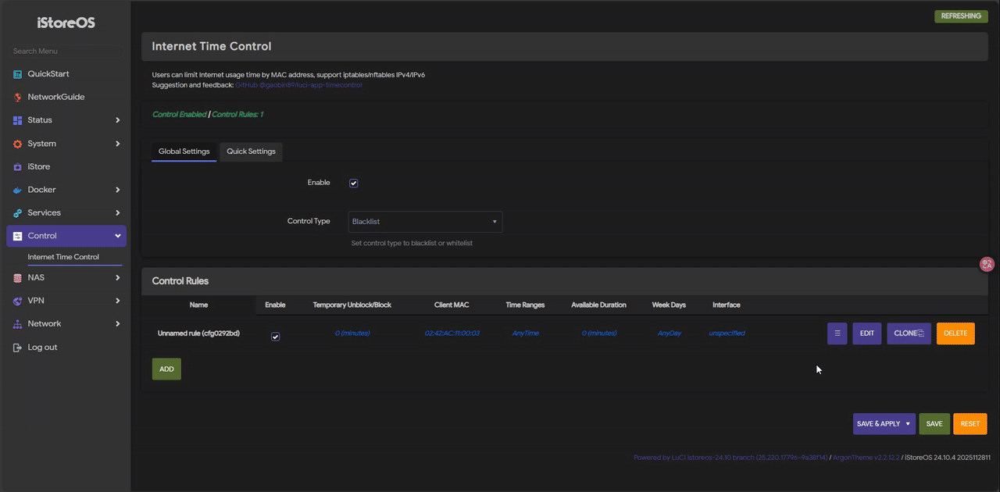

# luci-app-timecontrol

[中文](#中文) | [English](#english)

---

## 中文

### 版本说明

- **Lua版**：基于[Lienol luci-app-timecontrol](https://github.com/Lienol/openwrt-package/tree/main/luci-app-timecontrol)修改（已弃用）
- **JavaScript版**：全新UI界面、自主开发

本项目主要为家庭网络管理而设计，方便限制家庭成员使用各种电子设备（手机、平板、TV）。例如：根据特定任务的完成情况，可方便地给予临时时长奖励或惩罚，且不会忘记重新开启限制。

### 功能特性

#### 1. 支持单一规则多MAC地址、多时段
- 单条规则可配置多个MAC地址和多个时间段
- 简化配置管理，提高规则复用性

#### 2. 自适应FW3/FW4防火墙
- 自动检测系统使用的防火墙类型
- 兼容OpenWrt不同版本的防火墙系统（仅在[iStoreOS](https://github.com/istoreos/istoreos)、[LEDE](https://github.com/coolsnowwolf/lede)、[OpenWrt](https://github.com/openwrt/openwrt)上测试，理论上所有OpenWrt版本通用，请自行测试）

#### 3. 支持IPv4/IPv6
- 支持IPv4、IPv6网络限制
- 自动清理IPv4/IPv6链接（需要单独安装‘conntrack’命令）

#### 4. 星期设置
- 星期全选或全未选择均视为"每天"生效

#### 5. 规则守护功能
- 防止开启OpenClash等工具后禁网规则不在链首位置
- 自动监测规则链顺序，确保禁网规则优先级
- 规则位置异常时自动修复

**注**：为节省资源和兼顾"临时解禁/封禁"功能，监测频率为：1次/60s

#### 6. 临时解禁/封禁功能
- 支持临时解除网络限制和封禁网络
- 时长范围：1~720分钟
- 提供便捷的一键解禁/封禁操作
- 方便给予临时性奖励或惩罚
- 临时性奖励或惩罚计时结束后，自动按原规则生效

#### 7. 防火墙规则写入优化

**FW3 iptables**：
- 单一规则多MAC地址采用'ipset hash:mac'集合方式写入规则链

**FW4 nft**：
- 单一规则多时段、多MAC地址均采用集合方式写入规则链
- 如时段转换成UTC时段后存在跨天，则自动拆分时段写入规则链

**注**：
- nft meta hour {"xx:xx:xx"-"xx:xx:xx"} 集合用法需要将时段转成UTC时段且不支持跨天时段（可能是nft的Bug）
- 例如：北京时间"06:00:00-13:00:00"转换为UTC时间后是"22:00:00-05:00:00"，这将导致nft报错"Error: Range negative size"。
   
   

- 解决方法：将北京时间"06:00:00-13:00:00"拆分成"06:00:00-07:59:59","08:00:00-13:00:00"后，则可正常写入。
   

#### 8. 管控类型
- 支持黑/白名单模式快速转换
- 默认 --> 黑名单模式
- **白名单**：支持指定拒绝接口（默认 --> 空，即：拒绝所有接口）、星期和时间范围。

**注**：白名单模式规则处理逻辑
- '禁网时段'为空和'星期'为每天（星期1~7）时，则表示全开放。
- Docker等使用NAT转发的，请在'拒绝接口'中排除相应接口或添加MAC地址到规则。
- '禁网时段'不为空时，则按设定的'禁网时段'和选中的'星期'禁网（即：按'黑名单'规则逻辑处理）。
- '禁网时段'为空和'星期'不为每天（星期1~7）时，则选中'星期'的所有时段禁网（即：按'黑名单'规则逻辑处理）。

---

## English

### Version Notes

- **Lua version**: Modified from [Lienol luci-app-timecontrol](https://github.com/Lienol/openwrt-package/tree/main/luci-app-timecontrol) (deprecated)
- **JavaScript version**: Brand-new UI, independently developed

This project is mainly designed for home network management, making it easy to restrict the usage of various electronic devices (phones, tablets, TVs) by family members. For example: you can conveniently grant temporary time rewards or penalties based on task completion without forgetting to re-enable restrictions.

### Features

#### 1. Single rule supports multiple MAC addresses and multiple time ranges
- A single rule can configure multiple MAC addresses and multiple time ranges
- Simplifies configuration management and improves rule reusability

#### 2. Adaptive to FW3/FW4 firewalls
- Automatically detects which firewall system the system uses
- Compatible with different OpenWrt firewall systems (tested on [iStoreOS](https://github.com/istoreos/istoreos), [LEDE](https://github.com/coolsnowwolf/lede), [OpenWrt](https://github.com/openwrt/openwrt); theoretically works with all OpenWrt versions, please test yourself)

#### 3. IPv4/IPv6 support
- Supports IPv4 and IPv6 network restrictions
- Automatically clears IPv4/IPv6 connections (requires separate installation of the ‘conntrack’ command)

#### 4. Weekday settings
- Selecting all weekdays or none is treated as "Every day"

#### 5. Rule guardian feature
- Prevents blocking rules from losing top-chain priority after enabling tools like OpenClash
- Automatically monitors rule-chain order to ensure blocking rules have priority
- Automatically fixes rule order when abnormal

Note: To save resources and support the "temporary unblock/block" feature, the monitoring frequency is 1 time per 60s.

#### 6. Temporary unblock/block feature
- Supports temporarily unblocking network restrictions or blocking network access
- Duration range: 1–720 minutes
- Provides convenient one-click unblock/block operations
- Useful for giving temporary rewards or penalties
- After the temporary period ends, original rules are automatically reinstated

#### 7. Firewall rule writing optimization

FW3 (iptables):
- For a single rule with multiple MAC addresses, rules are written using 'ipset hash:mac set' in the chain

FW4 (nft):
- For a single rule with multiple time periods and multiple MAC addresses, sets are used in the rule chain
- If converting time ranges to UTC results in crossing midnight, the time ranges are automatically split before writing to the rule chain

Note:
- nft meta hour {"xx:xx:xx"-"xx:xx:xx"} set usage requires converting time ranges to UTC and does not support ranges that cross midnight (this may be an nft bug)
- For example: Beijing time "06:00:00-13:00:00" converts to UTC "22:00:00-05:00:00", which causes nft to report "Error: Range negative size".
   
   

- Workaround: split Beijing time "06:00:00-13:00:00" into "06:00:00-07:59:59" and "08:00:00-13:00:00", then it can be written normally.
   

#### 8. Control modes
- Supports quick switching between blacklist and whitelist modes
- Default --> Blacklist mode
- Whitelist: supports specifying reject interface (default --> empty, i.e., reject all interfaces), weekdays and time ranges.

Note: Whitelist mode rule handling logic
- If 'time ranges' is empty and 'weekdays' is set to every day (Mon–Sun), it means fully open.
- For Docker and other NAT-forwarding cases, exclude the relevant interfaces in 'reject interface' or add MAC addresses to rules.
- If 'time ranges' is not empty, then blocking is applied according to the configured 'time ranges' and selected 'weekdays' (i.e., handled as blacklist logic).
- If 'time ranges' is empty and 'weekdays' is not every day, then all times on selected weekdays are blocked (i.e., handled as blacklist logic).
